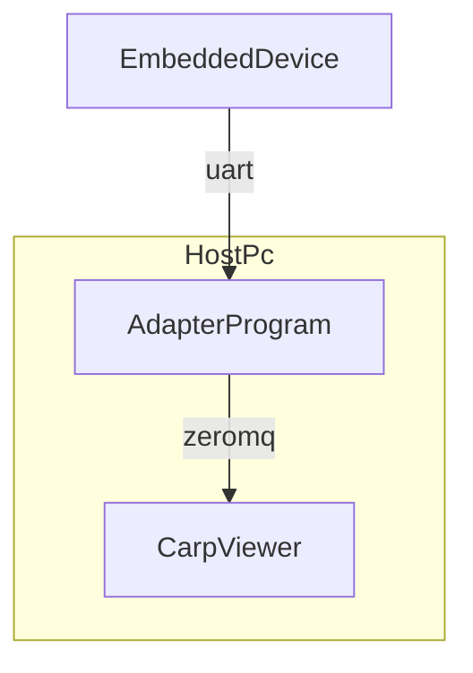

# Carp
Carp is a "dictionary based logging" library focussed on applications with constrained
resources

## Features
* Tiny footprint of dictionary messages
* Little overhead: 1 byte per transmitted value, 4 byte message id 1 byte domain id, 4 byte timestamp. 
* Heapless
* Support for multiple domains to facilitate multiple log channels and easier development of larger systems
* Git awareness
* Only pay-what-you use: Most of carp's code is templated and only ever instanced, if it is actually required.
* Developer convenience: No need to have a preprocessing step to keep the string database up to date at all the times. During development a fallback mode is available that will always work as well, although it is less efficient.
* Simple integration: Just implement an interface with three functions and you are ready to go.
* Unoppinionated: Carp does not impose a protocol format or similar. It only renders its message data to any "writer" instance you provide.
* Great Tooling: Carp comes with a suite of tools intended to integrate into your development cycle
* C++ & Rust ports with first class support for mixed codebases

## Similar Libraries
* Trice: https://github.com/rokath/trice
* DeFMT: 

## LogCarp Format

A message consists of a flexibly sized frame with the following layout:

| Timestamp | Domain Id | Message Id | NumParams | Parameters |
|-----------|-----------|------------|-----------|------------|
| 4 Byte    | 1 Byte    | 4 Byte     | 1 Byte    |Variable    |

With the parameter field being `NumParams` entry of the following layout:
| TypeId | Data     |
|--------|----------|
| 1 Byte | Variable |

The length of the data field depends on the type id provided.
The following ids are valid:
* 0x00: u8, 1 Byte data
* 0x01: u16: 2 Byte data
* 0x02: u32: 4 Byte data
* 0x03: i8: 1 Byte data
* 0x04: i16
* 0x05: i32
* 0x06: f32
* 0x07: f64
* 0x08: raw string, first two bytes contain the length as unsigned integer

Endianness is LE by default.

ToDo: Severity?

## Interfacing with the viewer
Since carp does not impose a protocol or transport layer it is up to the integrating
application to do so. This might mean:

* Blasting out carp records on a UART without any additional bells and whistles
* Sending carp records embedded within a protocol using sockets
* Sending carp frames as payload of a multi channel / multiplexed protocol

This poses a couple of issues:
* The viewer is not aware of your transport protocol. And while it is a rather simple
  program and could be easily modified to suit your needs it would probably be better
  for it to interface to any external tooling you already have in place.
* carp's philosophy of "it just works" is not helped if a user would have to build
  her own viewer, which would need maintenance and the like. We'd much rather provide
  an interface where the user could "dump" carp records for display.

To facilitate easy integration carpviewer uses zeromq. Zeromq has a ton of libraries
available for most common languages. Any integrating program will just have to send
carp record data to the viewer using zeromq. Note that the viewer is able to deal with
fragmented records, i.e. it is legal for an integrating program to split a record into
any number of zeromq messages, provided the record is eventually complete. The latter 
is important, due to carp records nature of not containing any synchronization data
(such as start or stop control bytes). If bytes are omitted from a record the viewer
will not be able to recover from that. It is up to the user's transport mechanism to 
ensure correct transport of the frame.

Diagram of integration

